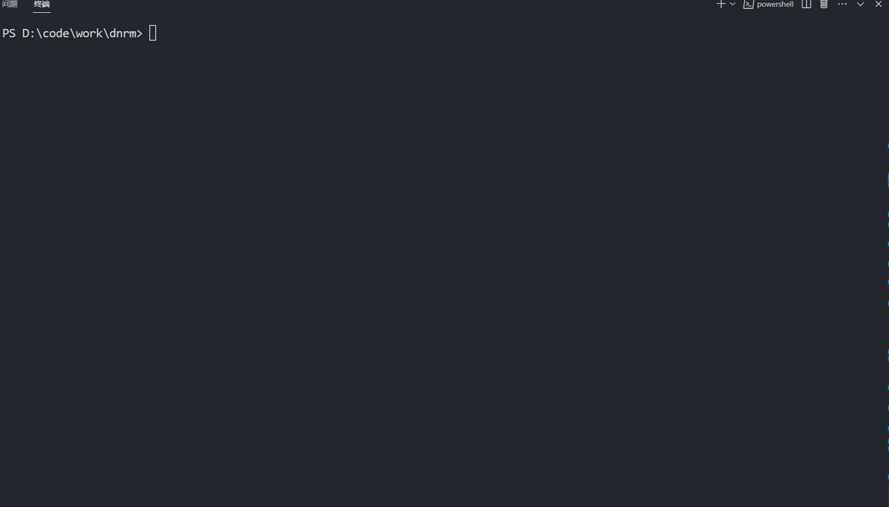

<div align="center">
    
    <h1>dnrm</h1>
    <p>deno 实现的 nrm，每次切换源都在 200ms 内，速度超级快</p>
</div>

## Usage

### install

1. 下载该项目到本地

2. 在项目根目录下执行命令

```shell
deno task install
```

### cli

```shell
# 查看当前源
dnrm

# 切换 taobao 源
dnrm use taobao

# 查看所有源
dnrm ls

# 测试所有源
dnrm test

# 设置源在本地
dnrm use taobao --local

# 查看帮助
dnrm -h

# 查看版本号
dnrm -V
```

<br />

## License

Made with [markthree](https://github.com/markthree)

Published under [MIT License](./LICENSE).
