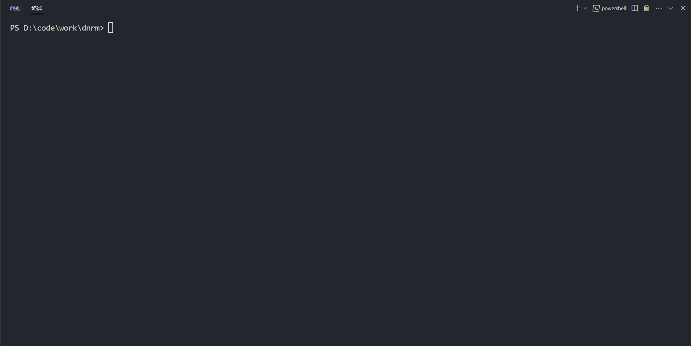

<div align="center">
    
    <h1>dnrm</h1>
    <p>deno 实现的 nrm，每次切换源都在 100ms 内，速度超级快</p>
</div>

<br />

## Usage

### install

#### 1. 模块安装

```shell
deno install --allow-read --allow-write --allow-env --allow-net -rfn dnrm https://deno.land/x/dnrm/mod.ts
```

#### 2. 本地安装

1. 下载该项目到本地

2. 在项目根目录下执行命令

```shell
deno task install
```

### cli

```shell
# 查看当前源
dnrm

# 切换 taobao 源
dnrm use taobao

# 查看所有源
dnrm ls

# 测试所有源
dnrm test

# 设置源在本地
dnrm use taobao --local

# 查看帮助
dnrm -h

# 查看版本号
dnrm -V
```

<br />

## 优化原理

1. `deno` 的冷启动比 `node` 更快
2. 针对 `registry` 配置使用正则快速获取和替换配置，不使用任何耗时的解析器，不需要序列化和反序列化
3. 直接针对配置文件进行配置替换，而不是调用子进程执行 `npm config set registry=...`，因为 `npm` 内部分支太多，这是卡的主要原因

<br />

## License

Made with [markthree](https://github.com/markthree)

Published under [MIT License](./LICENSE).
